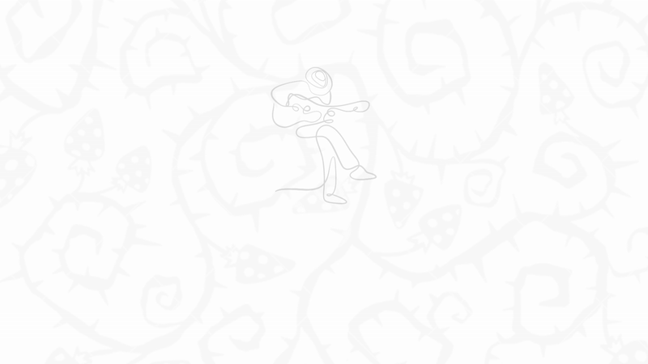
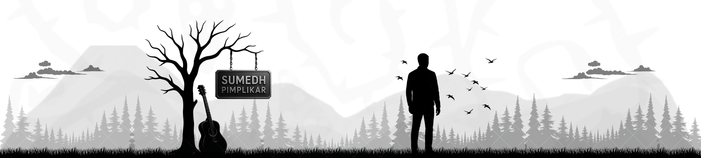
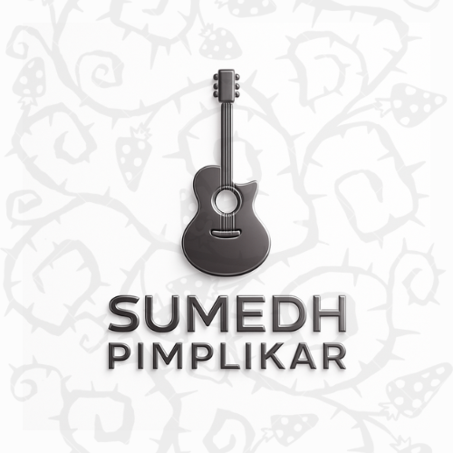
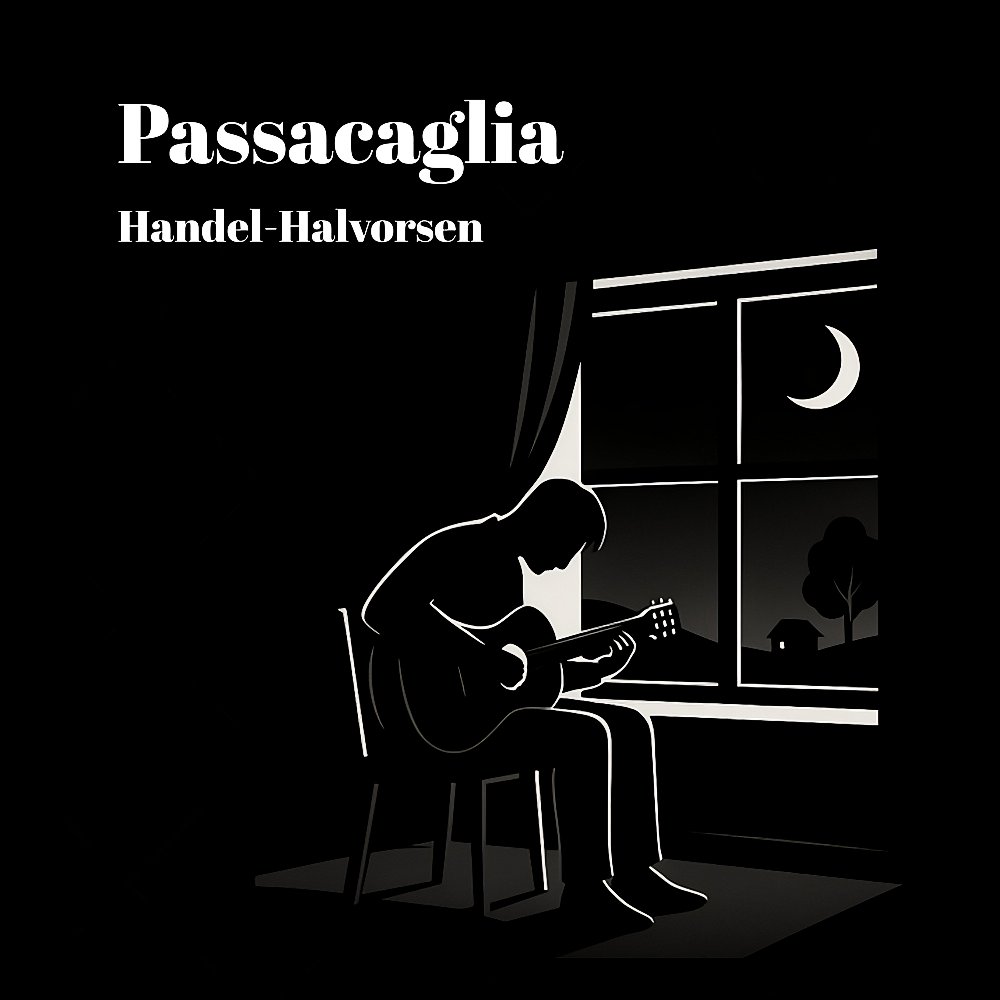
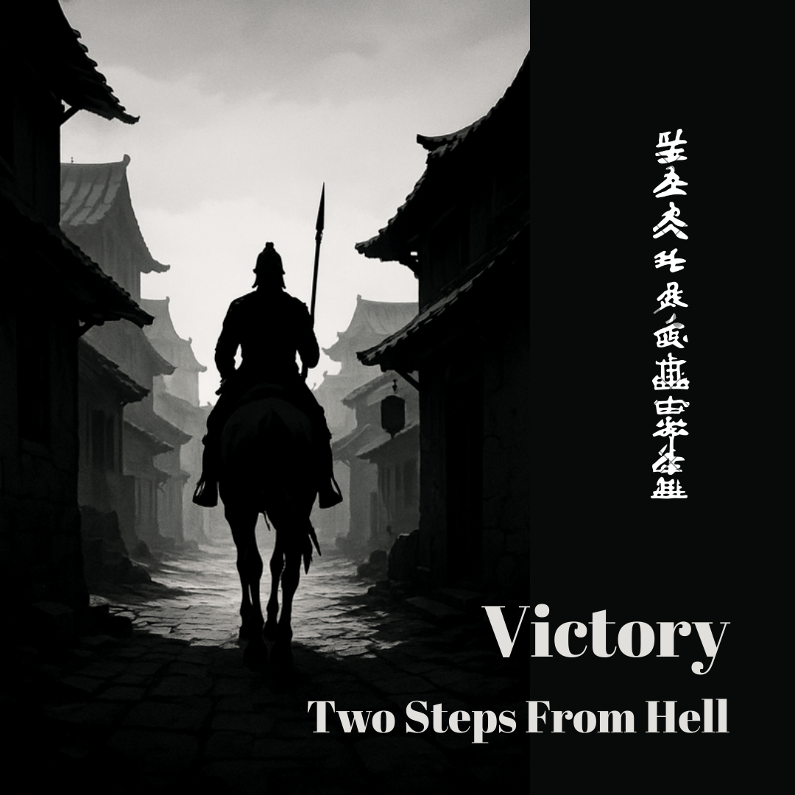

  

  
  
  

<!-- TITLE with Animated Typing Effect -->

  

  

 

   
  
  

  

 

  

<table align="center">
  
  <tr>
    <td></td>
    <td></td>
    <td></td>
    <td></td>
  </tr>

   <tr>
    <td></td>
    <td></td>
    <td></td>
    <td></td>
  </tr>

   <tr>
    <td></td>
    <td></td>
    <td></td>
    <td></td>
  </tr>

  <tr>
    <td></td>
    <td></td>
    <td></td>
    <td></td>
  </tr>

  <tr>
    <td></td>
    <td></td>
    <td></td>
    <td></td>
  </tr>

  <tr>
    <td></td>
    <td></td>
    <td></td>
    <td></td>
  </tr>
  
  
</table>

  

<!-- YOUTUBE CALL TO ACTION -->

  

